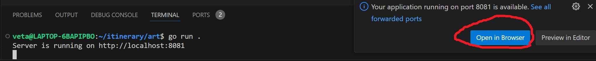
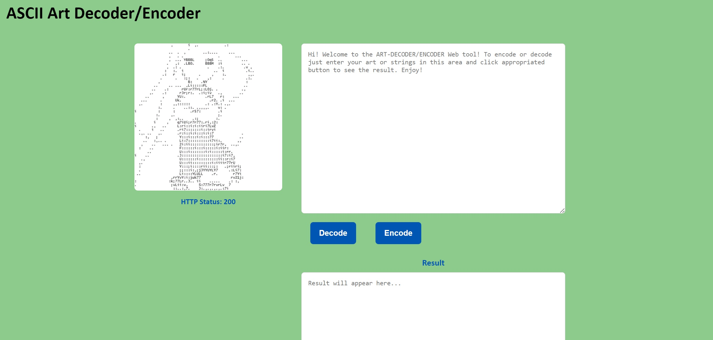
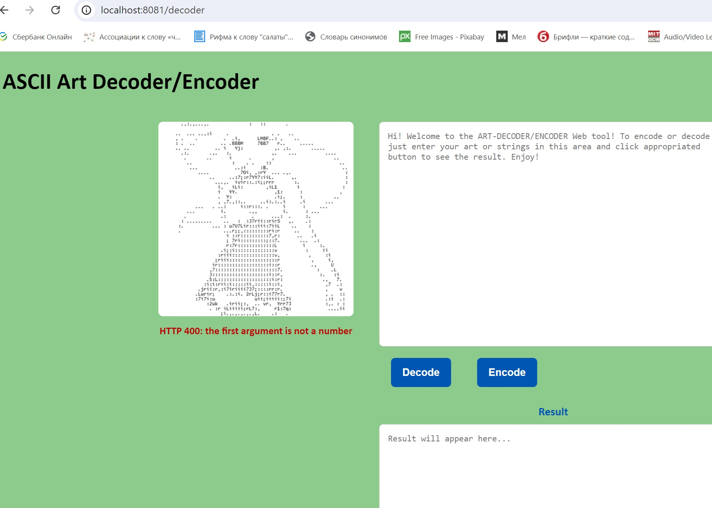
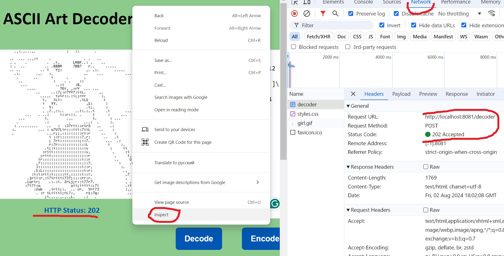

# ART DECODER/ENCODER Web Interface
This project provides a web interface for encoding ASCII art or decoding strings.

# Installation

## How to Run the Server

1. You need to have Go installed.
Clone the repository + update settings:
 ```
   git clone https://gitea.koodsisu.fi/tanjav/art
   
   go mod tidy
   ```
    
2. To run the server use the command line command in the main ./art directory:
```
go run .
```

 
3. After a pop-up showing up open your browser and navigate to `http://localhost:8081`


4. If the programs launched successfully you should see in browser:



## Usage 

- Enter your ASCII art or encoded string in the input textarea.
- Click "Encode" to encode the input.
- Click "Decode" to decode the input.
- The output will be displayed in Result area.


```
Input:
                    | 
____________    __ -+-  ____________ 
\_____     /   /_ \ |   \     _____/
 \_____    \____/  \____/    _____/
  \_____                    _____/
     \___________  ___________/
               /____\

Result:              

[20  ]| 
[12 _][4  ][2 _] -+-[2  ][12 _] 
\[5 _][5  ]/[3  ]/_ \ |[3  ]\[5  ][5 _]/
 \[5 _][4  ]\[4 _]/[2  ]\[4 _]/[4  ][5 _]/
[2  ]\[5 _][20  ][5 _]/
[5  ]\[11 _][2  ][11 _]/
[15  ]/[4 _]\

```

## Endpoints checking and errors handling

+ GET 200/: Returns the main page of the web interface.
+ POST 202 /decoder: Accepts a decoded/encoded string and returns the result.
+ POST 400/decoder: Returns HTTP400:Bad Request for malformed input.

The result of the last HTTP response code is displayed as a message below the gif image to the left of the input box.


To check the HTTP responses for the endpoints, open the bottom menu item "Inspect" by right-clicking. Then select the "Network" section and clicking on the name "decoder", look in the submenu "Headers"



### This project was built with Go, HTML and CSS and demonstrates basic web server functionality and string manipulation techniques.

## Extra
1. The web interface is designed with colour and formatting, styled with CSS.
1. The web interface features an ENCODE mode, to convert text-based art into an encoded string.
1. The POST /decoder endpoint returns HTTP400 for malformed encoded strings with a message  specifying the reason why the error occurs.

